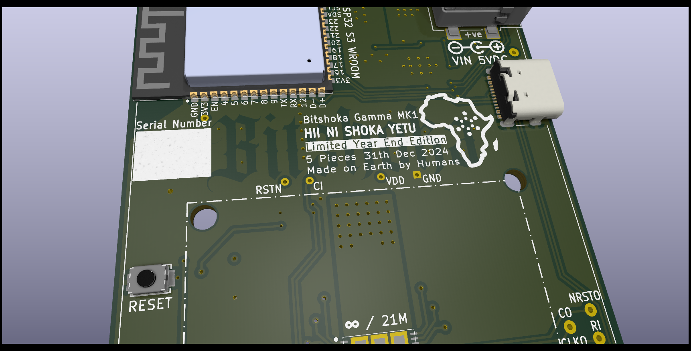

```
Open Source is Intrinsic to Bitcoin
```
# The bishokaGamma
The bitshoka gamma is a fork of the reference bitaxe gamma 601 design. It is  electrically identical with only some mechanical and graphical changes.



## Current Status
- The bitshoka design is untested 

# Changes
Changes from the bitaxe gamma 601 reference design:

1. all caps and resistors changed to 0805 or larger to enable hand soldering
2. Testpoints changed to through hole versions for accessibility from both board sides.
3. Placed testpoints outside of the heat sink area for accessibility
4. Re-located components to accommodate above changes
5. Added ground plane pours on all layers where space permitted for better heat conductivity and spread along the board
6. Improved the symmetry of the heat sink alignment with the chip and and mounting holes  3 x 58.483mm
7. Added labels on both sides for better readability
8. Squared out the board 
9. Added 2 large solder joints for an alternate power supply to the barrel connector, which can optionally also take a terminal block or phoenix terminal
10. Added footprints for optional external i2c pullip resistors (if needed)
11. Changed 2 heat sink mounting holes for an alternate heat sink 3 x 53.2mm
12. L1 Footprint was changed to fit the LCSC C5273929 datasheet specs
13. Components were aligned and straightened
14. Copper areas were adjusted and tweaked
15. New Bitshoka logo included as an exclusion area
16. The OLED connector was replaced with a "straight" type.

# BOM
## SMD
## ASIC
At the heart of the bitaxeGamma is a BM1370 Bitcoin mining ASIC from the Antminer S21 Pro from Bitmain. It's not open source.

- Bitmain claims the BM1370 has 15 J/TH efficiency. We can get pretty close to that with the BitaxeGamma
- The Antminer S21 Pro has a nominal hashrate of 234 TH/s. There are 3 hashboards with 65 chips each, for a total of 195 chips. The bitaxeGamma has a single one of these chips. That means _about_ 1.2 TH/s per bitaxeGamma. Initial testing looks good!
- The BM1370 is brand new and isn't available individually yet. The best place to get these chips is right out of a S21 Pro.
- The BM1370 has a different footprint and pinout from the BM1368, BM1366, BM1397 and BM1387 in previous bitaxe.

## PCB Hardware
This repo contains all of the design files for the PCB. [KiCAD](https://www.kicad.com) software is used. There is a BOM file for all of the components that get soldered to the PCB. 

- Order PCBs from your favorite PCB shop, like [JLCPCB](https://jlcpcb.com), [SeeedStudio](https://www.seeedstudio.com/fusion_pcb.html), or [PCBWay](https://www.pcbway.com)
    - PCBs are 4-layer, 6mil trace/space and 0.3mm hole compatible. 1oz outer / 0.5oz inner layer thickness works well.
    - Make sure to order stencils too. These are the "paste" layers in the gerbers folder. one for top and one for bottom.
- All PCB parts except the ASIC are available from [LCSC](https://www.lcsc.com/) and others. You can find LCSC part numbers in the BOM

## Extra Hardware
There are a few other hardware components that are needed for a complete bitaxe.

- **Heatsink**
-  **Fan**
- **Thermal compound**
- **Display**
- **Power Supply**
	- **5V DC 4A 30 - 30W  
	- The bitaxe uses a 5.5x2.1mm, center-positive barrel jack. 5.5x2.5mm plugs have been known to work.
- **Stand**
	- The PCB has corner mounting holes.
## Firmware
- The [ESP-Miner](https://github.com/skot/ESP-Miner) has initial support for the BM1370 ASIC. Improvements are ongoing.


### ESP32 Programming Requirements
- ESP32 programming is done through a USB-C cable and connector. See [ESP-Miner](https://github.com/skot/ESP-Miner) for more details.

## Further Information
- Project page at [bitaxe.org](https://bitaxe.org)
- [Open Source Miners United](discord.gg/osmu) Discord chat
- [building.md](building.md) for PCB ordering tips
- [assembly.md](assembly.md) for assembly tips
